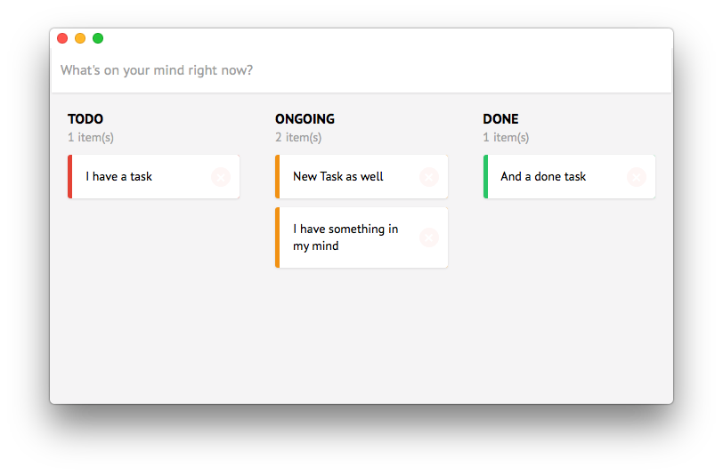
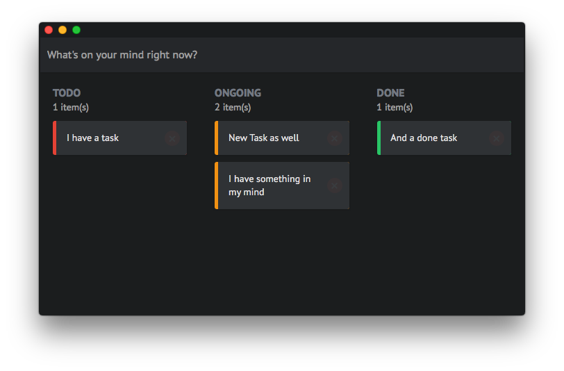
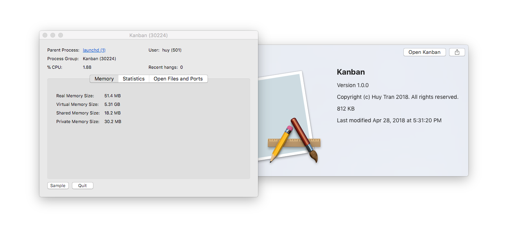

# Desktop Kanban Board

Look ma, no Electron!





## What is this?

This is a web-based Kanban board application, built with Elm and Rust.

The only different from this application and hundred thousands of web-based application out there is: **We don't need [Electron](https://electronjs.org/)!**.

Instead, it use native WebView (WebKit for Linux/macOS, and MSHTML on Windows), more details [see here](https://github.com/zserge/webview).

The whole source code in this repository is just a desktop client, which you can actually use for **any** web-based application.

_Note: I maintain my own version of [zserge/webview](https://github.com/zserge/webview) and [Boscop/web-view](https://github.com/Boscop/web-view), because I want to add some customized titlebar on macOS, and my code is ugly enough to create a PR on these repos._

## Instruction

### Step 1: Build the web application

**Skip this if you're using an online hosted application from an URL, or building your own app**.

Clone the [Kanelm](https://github.com/huytd/kanelm) application source code from here https://github.com/huytd/kanelm 

Follow the instruction in that repo to config your jsonbin.io config, then install the dependencies and build it:

```
yarn install
elm-package install
yarn build
```

What you will get is a `dist` folder, and you only need the `dist.js` file, copy it to `www` folder of this repo.

```
└── www
    └── dist.js
```

### Step 2: Build the desktop application

You gonna need [cargo bundle](https://github.com/burtonageo/cargo-bundle).

Install it, then run:

```
cargo bundle --release
```

Now you got it.

## Wait, what happened?

Well, the Elm application will be compiled into a single `dist.js` file, the content of this JavaScript file will be inlined into our Rust source code:

**src/main.rs**
```rust
let html = format!(r#"
    <html>
        <head>
        <link href="https://fonts.googleapis.com/css?family=PT+Sans" rel="stylesheet"> 
        <style>{css}</style>
        </head>
        <body>
        <script>{js}</script>
        </body>
    </html>
    "#,
    css = r#"body { background: #1d1f21; }"#,
    js = include_str!("../www/dist.js"));
```

The Rust application will then create a new window, contains a webview, load this HTML content into that webview, and that's it.

## But Electron did the same thing?

Yeh, but sometimes, all you need is just a webview to display your web application on a desktop. You don't need file system access or automatic update, blah blah, it would be a huge waste to ship your app with >100MB of Chromium and V8 in it.

In fact, this application only uses 0-3% CPU and the bundle size is >800KB on macOS.


